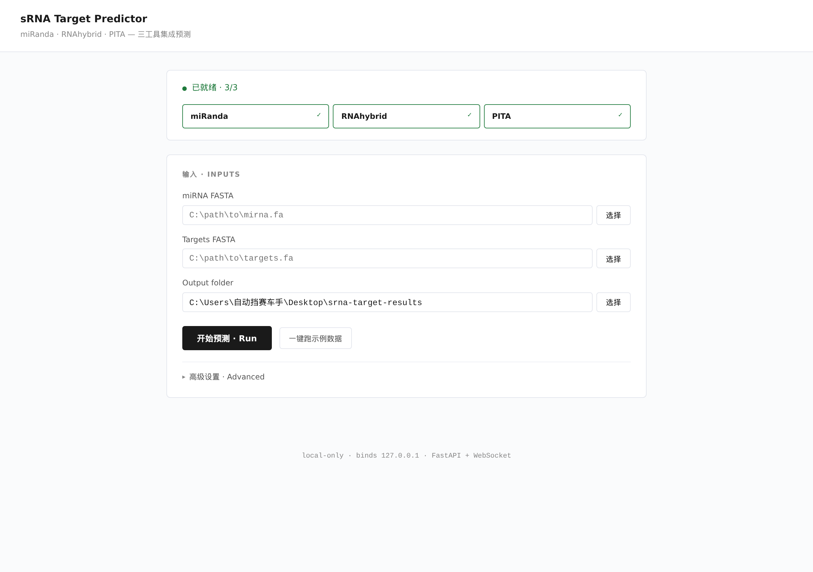
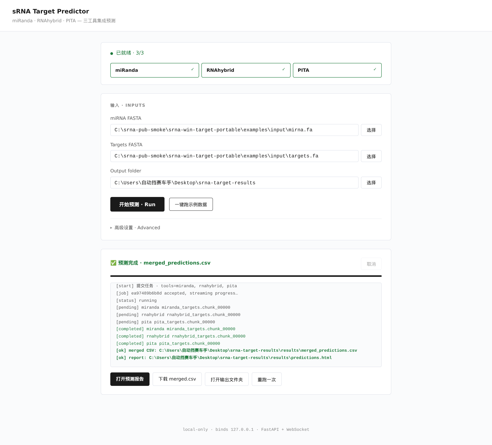
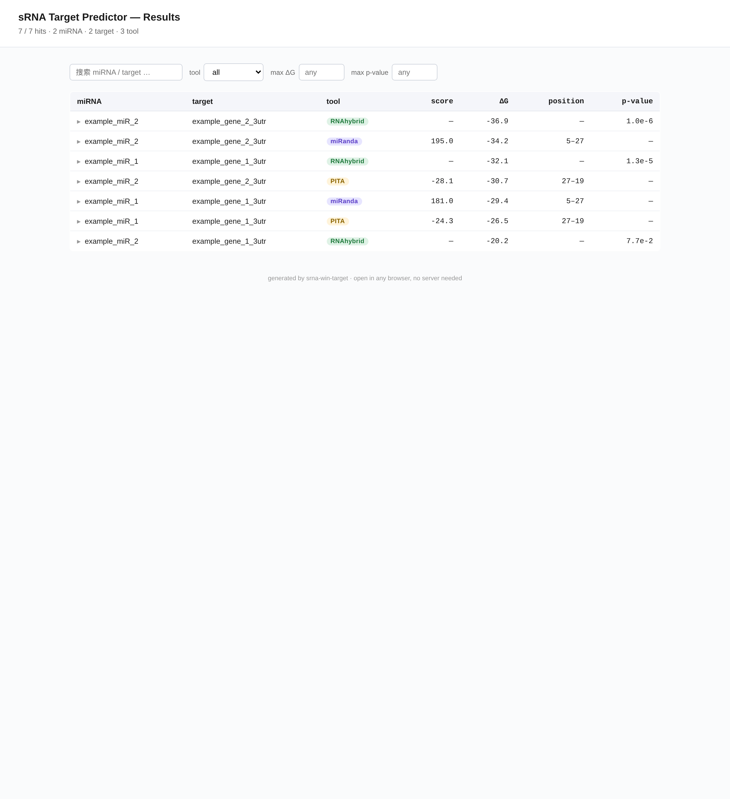
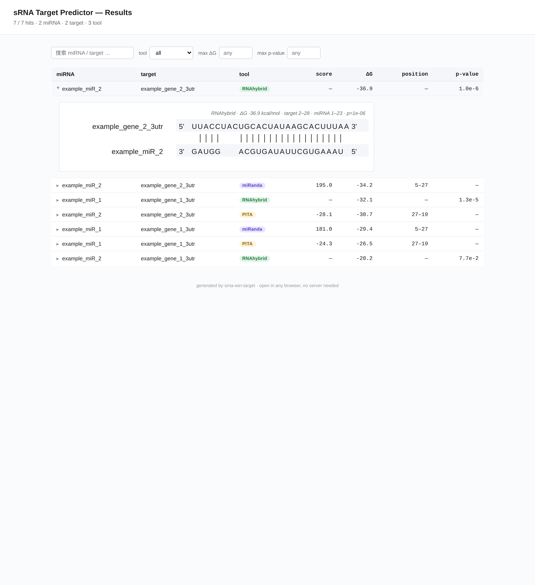
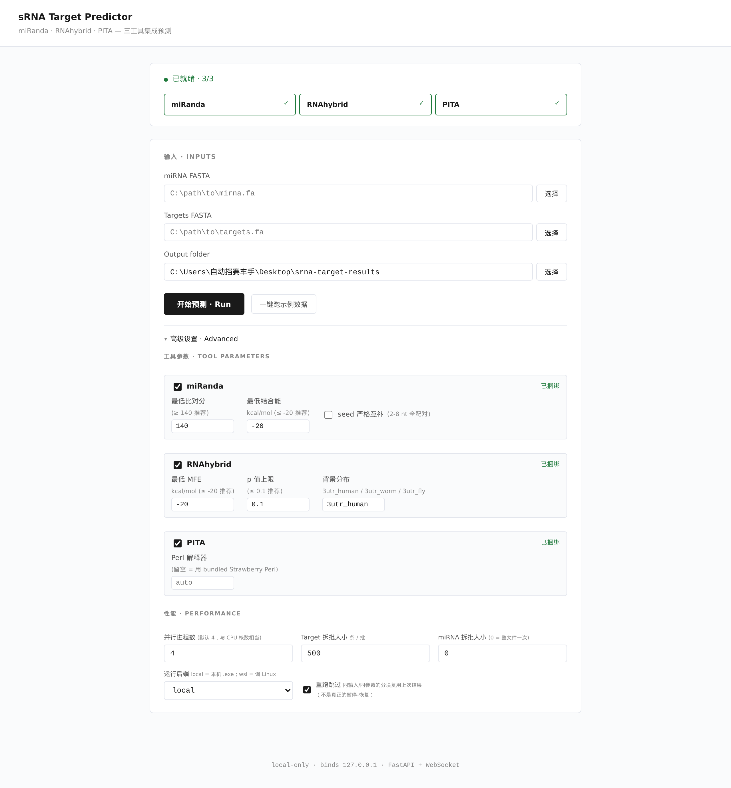

# sRNA Target Prediction · Windows 桌面版

> Windows 上的 sRNA / miRNA **靶基因预测**工具：双击 `.exe` 就能用，**不需要装 Python、不需要装 Perl、不需要装 conda、不需要装 WSL、不需要写一行代码**。
>
> 集成了 miRanda + RNAhybrid + PITA 三个常用工具，并把三家的结果合并成一张 CSV + 一个可在浏览器里查看的 HTML 报告。

---

## 一、它是什么 / 不是什么

**是什么**：一个把"上传 FASTA → 跑预测 → 看结果"做成网页按钮的桌面应用。后台是 FastAPI 起的本地服务器（只绑 `127.0.0.1`，不联网、不上传任何数据），前端是浏览器界面。

**不是什么**：不是一个新算法。miRanda / RNAhybrid / PITA 的预测结果与各自上游软件**逐位一致**（PITA 的 ΔG / ddG 已经和 Linux 服务器参考完整对过）。

适合：

- 不会写 Python / Perl / shell 但需要跑 miRNA 靶标预测的本科生、研究生
- 不想为了一次预测专门装 WSL + conda + ViennaRNA 的实验室成员
- 课题前期做 pilot 筛选，不想反复 ssh 上服务器的人

不适合：

- 一次跑十万条 UTR 长序列 —— 单机够用但慢；那种规模请上 HPC
- 想跑 IntaRNA 或者其他 5 个工具 —— 目前只集成了 miRanda / RNAhybrid / PITA

---

## 二、四步上手

### 1. 下载

去本仓库的 [**Releases**](../../releases) 页面，下载 `srna-win-target-portable.zip`（约 77 MB）。

### 2. 解压

解压到任意位置都行（桌面、D 盘、U 盘都可以），**但路径里不要有空格** —— PITA 的 perl 脚本拼接 shell 管道时不会自动加引号。中文路径 OK，空格不行。

```
srna-win-target-portable\
├── srna-win-target-web.exe        ← 双击这个
├── bundled_tools\                  ← 已经打包好的三个工具
│   ├── miranda\miranda.exe
│   ├── rnahybrid\RNAhybrid.exe
│   └── pita\... (含 patched Vienna-1.6 + Strawberry Perl 5.42 + busybox)
├── examples\input\                 ← 自带的演示数据
├── README.txt
└── LICENSES\NOTICE.txt
```

### 3. 双击 `srna-win-target-web.exe`

第一次启动会弹一个黑色控制台窗口（这是 FastAPI 服务器，**不要关**），几秒后默认浏览器自动打开 `http://127.0.0.1:5173`，看到下面这个界面就说明启动成功了：



顶上绿色圆点 + "已就绪 · 3/3" 表示三个预测工具都已经被自动找到。

### 4. 跑示例数据

直接点 **"一键跑示例数据"**，软件会用 `examples/input/` 里自带的 2 条 miRNA + 2 条 UTR 跑一次，大约 2 秒。看到底部出现绿色 ✅ "预测完成" 就成了：



四个按钮：

| 按钮 | 做什么 |
|---|---|
| **打开预测报告** | 在浏览器里打开 HTML 报告（下面有截图） |
| **下载 merged.csv** | 三个工具的命中合并表，可以直接拖进 Excel / R / Python |
| **打开输出文件夹** | 用资源管理器打开默认的 `桌面\srna-target-results\` |
| **重跑一次** | 清空界面回到 idle，准备跑下一次 |

---

## 三、看结果：HTML 报告

点 **"打开预测报告"** 弹出的是一张可筛选、可排序、可展开的预测命中表：



- 顶部统计：`7 / 7 hits · 2 miRNA · 2 target · 3 tool`
- 搜索框：按 miRNA / target ID 模糊搜索
- `tool` 下拉：只看 miRanda / RNAhybrid / PITA 中的一种
- `max ΔG`：填一个上限（比如 `-20`），只看比这个更稳定的命中
- `max p-value`：按 p 值上限筛（只对 RNAhybrid 有意义）
- 表头任意列点一下就排序

**点任意一行**，会展开一个 alignment 图，画出 miRNA 和 target 之间到底是怎么互补的（实线 = 标准 Watson-Crick 配对，虚线断开 = wobble 配对）：



字体严格按 Nature/Cell figure 标准：标签 Arial、序列 Courier 单宽字体，全黑，所有字母大写，T → U，方便直接截图丢进文章 figure。

---

## 四、用自己的数据

回到主界面，把上面"一键跑示例数据"换成**手动选自己的 FASTA**：

1. 点 **miRNA FASTA** 行右边的"选择" → 在弹出的 Windows 原生文件对话框里选你的 miRNA FASTA
2. 点 **Targets FASTA** 行右边的"选择" → 选你的 UTR / 转录本 FASTA
3. **Output folder** 默认是 `桌面\srna-target-results\`，可以改；只要 **不含空格** 就行
4. 点黑色 **"开始预测 · Run"**

进度会实时打在底下黑灰色 log 框里。跑完和点示例一样会出四个结果按钮。

### FASTA 输入要求

软件会做格式检查，如果输入不对它会直接告诉你为什么：

- `首行不是 '>' 开头` → 你给的不是 FASTA
- `文件为空` / `只有空白行` → 文件被清空了
- `共 N 条记录，全部超过 50% 非 ACGTU 字符` → 你大概率传成了**蛋白序列**

可以是：

- 标准 FASTA (`.fa / .fasta / .fna`) 或 FASTQ（自动转 FASTA）
- T 或 U 都可以，软件统一转 U
- 含 IUPAC 简并字符 (`R/Y/K/M/W/S/N` 等) OK，非法字符会自动替换为 N
- 重复的 ID 会自动改名 `xxx_dup1 / xxx_dup2 ...`

---

## 五、高级设置（绝大多数人不用动）

主界面下方有一行折叠 **"▸ 高级设置 · Advanced"**，展开后长这样：



里面能调的东西：

**每个工具的阈值**（推荐值已经预填）

| 工具 | 默认值 | 含义 |
|---|---|---|
| miRanda 比对分 | ≥ 140 | 越高越严格 |
| miRanda 结合能 | ≤ -20 kcal/mol | 越负越稳定 |
| RNAhybrid MFE | ≤ -20 kcal/mol | 同上 |
| RNAhybrid p 值 | ≤ 0.1 | 越小越显著 |
| RNAhybrid 背景分布 | `3utr_human` | 也可以填 `3utr_worm` / `3utr_fly` |

**性能**

| 选项 | 默认值 | 什么时候改 |
|---|---|---|
| 并行进程数 | 4 | 跑大数据时改成 CPU 核数 |
| Target 拆批大小 | 500 条/批 | UTR 库特别大时调小 |
| miRNA 拆批大小 | 0 (一次跑完) | miRNA 数量比 UTR 还多时设成几十 |
| 运行后端 | `local` | 想调 WSL2 里 Linux 版本时切 `wsl` |
| 重跑跳过 | 勾选 | 同输入同参数的分块，二次跑直接复用上次结果（**不是**真正的暂停-恢复） |

---

## 六、常见问题

**Q：双击 exe 之后浏览器没自动打开？**
A：手动打开浏览器，地址栏粘贴 `http://127.0.0.1:5173`。如果还是空白，看黑控制台窗口里有没有报错，多半是端口被占了 —— 改用环境变量 `SRNA_WEB_PORT=5180` 启动（先在控制台 `set SRNA_WEB_PORT=5180`，再启动 exe）。

**Q：杀软提示 "未知发布者"？**
A：因为我们没买代码签名证书。它是开源的（这个仓库就是源码），你也可以拿源码自己用 PyInstaller 编译 —— `scripts\build_windows_exe.py web`。

**Q：PITA 那一行没出结果？**
A：先看输出文件夹路径有没有**空格** —— PITA 是唯一会因为空格挂掉的工具（在 Advanced 里把 Backend 切到 `wsl` 可以绕开，前提是你装了 WSL2）。中文路径、长路径都 OK，只空格不行。

**Q：merged_predictions.csv 里 PITA 的 score / energy 是什么列？**
A：因为三个工具的输出字段不完全对应，我们做了字段映射：

| CSV 列 | miRanda | RNAhybrid | PITA |
|---|---|---|---|
| `score` | 比对分 | 没有 | ddG |
| `energy` | 结合能 | MFE | dGduplex |
| `pvalue` | 没有 | p 值 | 没有 |

PITA 完整 13 列（dG5/dG3/dG0/dG1/dGopen/ddG 等）保留在 `work/raw/pita/*_pita_results.tab` 里。

**Q：解压完目录有多大？**
A：约 130 MB（exe 46 MB + bundled_tools 80 MB + 示例 + LICENSES）。

**Q：能不能跑 IntaRNA / RNA22 / TargetScan？**
A：暂时还没集成。这版本只锁定 miRanda + RNAhybrid + PITA。

---

## 七、源代码 / 贡献

这个仓库是 wrapper 源码：

- `src/srna_win_target/` —— Python 主包（FastAPI 服务器 + 调度器 + 解析器 + HTML 报告生成）
- `bundled_tools/pita/lib/*.pl` —— PITA 的辅助 perl 脚本（路径已从绝对改为相对，方便 Windows portable 打包）
- `bundled_tools/pita/pita_prediction.pl` —— PITA 驱动脚本（加了 `win_system` 兜底处理 cmd.exe 与 POSIX `;` 分号差异）
- `tests/` —— 81 个单元/集成测试
- `scripts/build_windows_exe.py` + `scripts/assemble_portable_zip.sh` —— Windows exe 与 portable zip 的打包脚本

二进制（miRanda / RNAhybrid / patched RNAduplex / RNAddG4 / Strawberry Perl / busybox 的 win64 .exe）**不在 git 历史里**，只在 GitHub Releases 里以 zip 形式发布。

要本地开发：

```bash
git clone https://github.com/1690834643/sRNA-target-prediction-windows
cd sRNA-target-prediction-windows
python -m venv .venv && source .venv/bin/activate
pip install -e ".[dev,web]"
pytest tests -q     # 81 passed, 2 skipped
```

---

## 八、引用

如果这个工具帮你做了正式发表的工作，建议同时引用三个底层算法：

- **miRanda** — Enright AJ et al. *Genome Biol* (2003): MicroRNA targets in Drosophila. doi:10.1186/gb-2003-5-1-r1
- **RNAhybrid** — Rehmsmeier M et al. *RNA* (2004): Fast and effective prediction of microRNA/target duplexes. doi:10.1261/rna.5248604
- **PITA** — Kertesz M et al. *Nat Genet* (2007): The role of site accessibility in microRNA target recognition. doi:10.1038/ng2135

---

## 九、许可与免责

- 本 wrapper 代码：MIT
- 内置工具：各自上游许可证见 `LICENSES/NOTICE.txt`（miRanda 学术许可，RNAhybrid / ViennaRNA GPL，PITA Weizmann 学术许可，Strawberry Perl Artistic/GPL）
- 仅供学术研究使用；商用前请逐个核对上游许可

预测结果仅供参考，不对任何下游实验结果负责。
